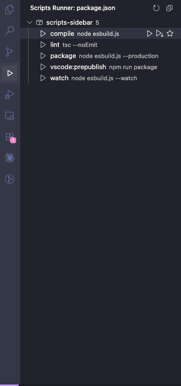

# Scripts Runner

> Run **npm, yarn, and pnpm scripts** straight from the VS Code sidebar — one click, no typing in the terminal.

## Features

### ▶️ One-click run
Every script in your `package.json` shows up in a dedicated **Scripts Runner** view on the Activity Bar. Click a script to run it, or use the inline buttons that appear on hover. Each script's command is shown right next to its name.

### 🏃 Two run modes
- **Terminal** — keeps full logs and supports `watch`, dev servers, and interactive commands. The terminal tab is named after the script and is reused per script.
- **Silent** — runs in the background and reports the result via a notification. Perfect for quick tasks like `lint` or `format`.

### ⏹ Stop & running state
A running script shows a spinner and a **stop** button so you always know what's live. Clicking a running script focuses its terminal instead of starting it again — no more accidentally restarting your dev server.

### ⭐ Pin your favorites
Pin the scripts you use most to a **Favorites** group at the top of the sidebar. Pins are remembered per workspace.

### 🔎 Status bar
- **Status bar** shows how many scripts are running — click it to stop one quickly.

### 🗂️ Stays tidy
- Fold the whole script list away — the collapsed state is remembered.
- **Monorepo friendly:** every `package.json` gets its own collapsible node.
- **Auto-detects** npm / yarn / pnpm from your lockfile.
- **Auto-refreshes** when `package.json` changes.

## Usage

1. Open a project that has a `package.json` with a `scripts` section.
2. Open the **Scripts Runner** view in the Activity Bar (left side).
3. **Click** a script to run it. On hover you get:
   - `▶` run in terminal
   - `▷` run silently
   - `☆ / ★` pin / unpin
   - `⏹` stop (while running)

## Extension Settings

| Setting | Default | Description |
|---|---|---|
| `scriptsSidebar.packageManager` | `auto` | `auto` / `npm` / `yarn` / `pnpm`. `auto` detects from the lockfile. |
| `scriptsSidebar.reuseTerminal` | `true` | Reuse each script's terminal instead of creating a new one every run. |

## Requirements

- VS Code `1.85.0` or newer.
- npm, yarn, or pnpm available on your `PATH` (whichever your project uses).

## Known Issues

- For scripts run in the **terminal**, the "running" indicator clears automatically when the command finishes **only if VS Code Shell Integration is enabled**. Without it, the indicator clears when you close the terminal or press stop.

## Release Notes

### 0.3.0
- CodeLens in `package.json` and a status bar running indicator.
- Silent-mode guard for long-running scripts + full output in an Output channel.
- Several reliability fixes (process-tree kill, running-state tracking, terminal reuse).

### 0.2.0
- Added **Stop** action and a running-state indicator (spinner).
- Added **Pin / Favorites**.
- Collapsible package node that remembers its state.
- Clicking a running script now focuses its terminal instead of re-running it.

### 0.1.0
- Initial release: sidebar with one-click run, terminal & silent modes, npm/yarn/pnpm auto-detection, auto-refresh, monorepo support.

---

**Enjoy!** If you find this useful, a rating on the Marketplace is appreciated. 🙌
